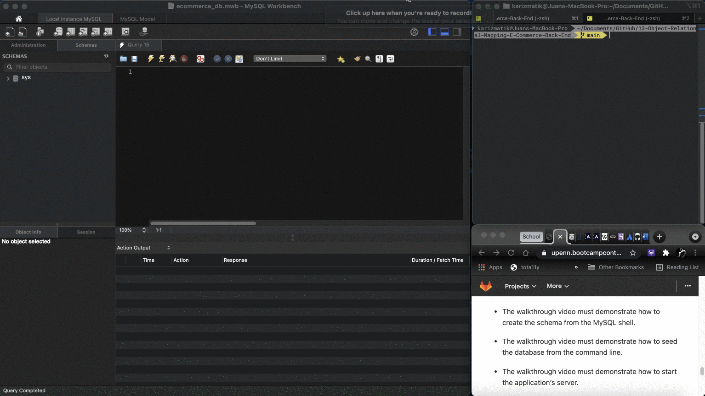
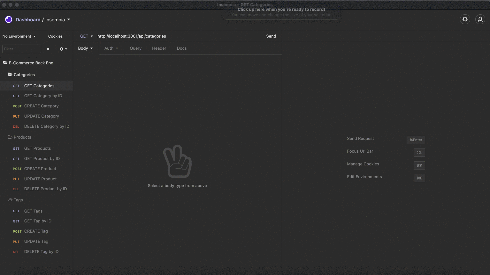
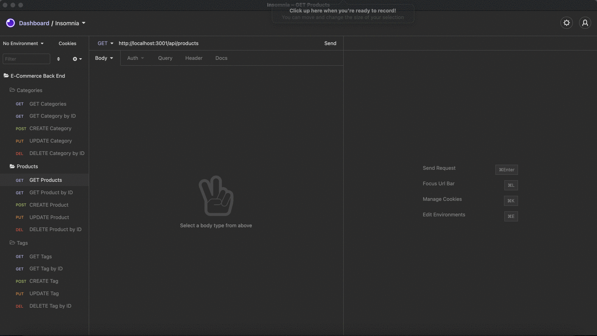
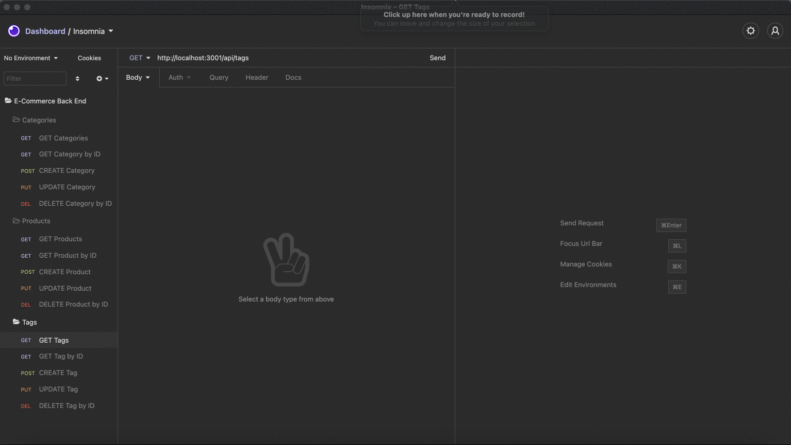

# E-Commerce Back End

## Description

Build the back end for an e-commerce site by modifying starter code and configure a working Express.js API to use Sequelize to interact with a MySQL database.

### Table of Contents

* [Mock-Up](#Mock-Up)

* [License](#license)

* [Questions](#questions)

## Mock-Up

The following animation shows the setup process:

The following animation shows the application's GET, POST, PUT, and DELETE routes for categories being tested in Insomnia Core:

The following animation shows the application's GET, POST, PUT, and DELETE routes for products being tested in Insomnia Core:

The following animation shows the application's GET, POST, PUT, and DELETE routes for tags being tested in Insomnia Core:

## License

This project is licensed under the MIT License.
Click [Link](https://choosealicense.com/licenses/mit/) for more information.

## Questions

Juan Sanchez

[Github Profile](https://github.com/karizmatik215)

juan.sanchez@phila.gov
